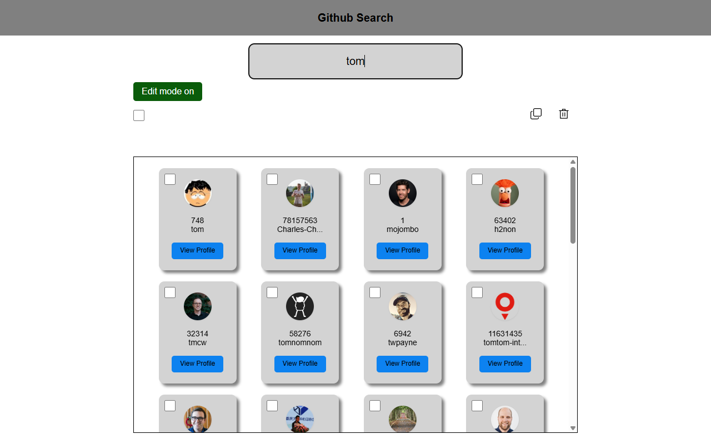

# GitHub User Search Project

This project is a front-end web application built with React and TypeScript that allows users to search the GitHub API for users. The application provides an interface to visualize search results and interactively manipulate them (selection, duplication, deletion).

This project emphasizes React state management (Hooks), testing best practices (Vitest, Testing Library), and asynchronous state handling (debouncing, API error management).

Visit an online version of this project [here](https://fulll-technical-assessment.vercel.app/).



---

## Features

### 1. Search and Display
*   **Asynchronous Search:** Queries the GitHub `search/users` API.
*   **Debouncing:** A `useDebounce` hook is implemented to prevent excessive API calls while the user is typing.
*   **State Management:** Displays clear feedback for **loading** states, **errors** (e.g., API rate limits), and **no results**.
*   **Focus Management:** The search input automatically regains focus after loading completes, providing a smoother user experience.
*   **Layout & Styling:**
    *   Long usernames are truncated using `text-overflow: ellipsis`.

### 2. Edit Mode and Selection
*   **"Edit Mode" Toggle:** A button allows the user to toggle edit mode. Disabling this mode resets the current selection.
*   **Individual Selection:** In edit mode, users can click cards to select or deselect them.
*   **Group Selection:**
    *   A "Select All" checkbox allows for selecting or deselecting all items at once.
    *   **3-State (Indeterminate) Checkbox:** The "Select All" checkbox accurately reflects the selection state:
        *   **Empty:** 0 items selected.
        *   **Checked:** 100% of items selected.
        *   **Indeterminate (dash):** 1-99% of items selected.
    *   A counter displays the total number of selected items.

### 3. List Actions
*   The following actions are **front-end only** and are reset when a new search is performed.
*   **Duplicate:** A "Duplicate" icon clones the selected users and appends them to the list with a new unique `appId`.
*   **Delete:** A "Delete" icon removes the selected users from the list.

---

## Tech Stack

*   **Framework:** React 18+
*   **Language:** TypeScript
*   **Build Tool:** Vite
*   **Testing:**
    *   Vitest (Test runner)
    *   React Testing Library (UI interaction testing)
    *   `@testing-library/jest-dom` (DOM matchers)
*   **Styling:** CSS Modules
*   **Documentation:** TSDoc (Code documentation standard)
*   **Custom Hooks:**
    *   `useDebounce`: To delay a value update.
    *   `useGithubSearch`: To encapsulate fetch logic, loading, and error states.


---

## Installation and Setup

To run this project locally, follow these steps:

1.  **Clone the repository**
    ```bash
    git clone [git@github.com:tboittin/Fulll---Technical-Assessment.git](git@github.com:tboittin/Fulll---Technical-Assessment.git)
    cd "Fulll - Technical Assessment/GitHub searchbar"
    ```

2.  **Install dependencies**
    ```bash
    npm install
    ```

3.  **Run the development server**
    ```bash
    npm run dev
    ```
    The application will be available at `http://localhost:5173`.

---

## Available Scripts

*   **`npm run dev`**: Starts the application in development mode.
*   **`npm run build`**: Compiles the application for production into the `/dist` folder.
*   **`npm run test`**: Runs the test suite in watch mode.
*   **`npm run coverage`**: Generates a test coverage report.

## Acknowledgements

This project was developed with the assistance of **Gemini**, Google's AI model, within the **WindSurf** environment.